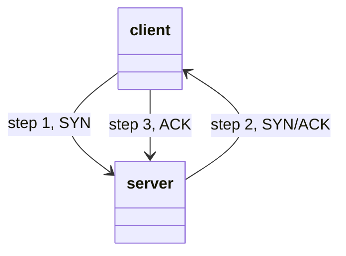

## Network basics - The OSI and TCP/IP model.
The OSI (Open Systems Interconnection) Model is a standardised model which is used to demonstrate the theory behind computer networking.
In practice, it's actually the more compact TCP/IP model that real-world networking is based off of.
| OSI Model | TCP/IP Model |
| --- | :---: |
| Application |              
| Presentation | Application |
| Session |                  
| Transport | Transport |
| Network | Internet | 
| Data Link | 
| Physical | Network Interface |    

## Layer 7 - Application 
The application layer of the OSI model essentially provides networking options to programs running on a computer. It works almost exclusively with applications, providing an interface for them to use in order to transmit data. 

When data is given to the application layer, it is passed down into the presentation layer.

## Layer 6 - Presentation
The presentation layer receives data from the application layer. This data tends to be in a format that the application understands, but it's not necessarily in a standardised format that could be understood by the application layer in the receiving computer. 

The presentation layer translates the data into a standardised format, as well as handling any encryption, compression or other transformations to the data. With this complete, the data is passed down to the session layer.

## Layer 5 - Session
When the session layer receives the correctly formatted data from the presentation layer, it looks to see if it can set up a connection with the other computer across the network. If it can't then it sends back an error and the process goes no further. 
If a session can be established then it's the job of the session layer to maintain it, as well as co-operate with the session layer of the remote computer in order to synchronise communications. The session layer is particularly important as the session that it creates is unique to the communication in question. 

This is what allows you to make multiple requests to different endpoints simultaneously without all the data getting mixed up (think about opening two tabs in a web browser at the same time). When the session layer has successfully logged a connection between the host and remote computer the data is passed down to layer 4, the transport layer.

## Layer 4 - Transport 
The transport layer's first purpose is to choose the protocol over which the data is to be transmitted. The two most common protocols in the transport layer are TCP (Transmission Control Protocol) and UDP (User Datagram Protocol). TCP transmission is connection-based which means that a connection between the computers is established and maintained for the duration of the request. This allows for a reliable transmission, as the connection can be used to ensure that the packets all get to the right place. 

A TCP connection allows the two computers to remain in constant communication to ensure that the data is sent at an acceptable speed, and that any lost data is re-sent. 

With UDP, the opposite is true, packets of data are essentially thrown at the receiving computer, if it can't keep up then that's its problem (this is why a video transmission over something like Skype can be pixelated if the connection is bad). What this means is that TCP would usually be chosen for situations where accuracy is favoured over speed (e.g. file transfer, or loading a webpage), and UDP would be used in situations where speed is more important (e.g. video streaming).

With a protocol selected, the transport layer then divides the transmission up into bite-sized pieces (over TCP these are called segments, over UDP they're called datagrams), which makes it easier to transmit the message successfully. 
| TCP | Transmission Control Protocol | UDP | User Datagram Protocol |
| --- | --- | --- | --- |
| TCP | Segements | UDP | Datagrams |

## Layer 3 - Network
The network layer is responsible for locating the destination of your request. For example, the Internet is a huge network; when you want to request information from a webpage, it's the network layer that takes the IP address for the page and figures out the best route to take.

At this stage we're working with what is referred to as Logical addressing (i.e. IP addresses) which are still software controlled. Logical addresses are used to provide order to networks, categorising them and allowing us to properly sort them. Currently the most common form of logical addressing is the IPV4 format, which you'll likely already be familiar with (i.e. 192.168.1.1 is a common address for a home router).

## Layer 2 - Data Link
The data link layer focuses on the physical addressing of the transmission. It receives a packet from the network layer (that includes the IP address for the remote computer) and adds in the physical (MAC) address of the receiving endpoint. Inside every network enabled computer is a Network Interface Card (NIC) which comes with a unique MAC (Media Access Control) address to identify it.

MAC addresses are set by the manufacturer and literally burnt into the card; they can't be changed -- although they can be spoofed. When information is sent across a network, it's actually the physical address that is used to identify where exactly to send the information.

Additionally, it's also the job of the data link layer to present the data in a format suitable for transmission.

The data link layer also serves an important function when it receives data, as it checks the received information to make sure that it hasn't been corrupted during transmission, which could well happen when the data is transmitted by layer 1, the physical layer.

## Layer 1 - Physical
The physical layer is right down to the hardware of the computer. This is where the electrical pulses that make up data transfer over a network are sent and received. 

It's the job of the physical layer to convert the binary data of the transmission into signals and transmit them across the network, as well as receiving incoming signals and converting them back into binary data.

| TCP/IP Model|
| :---: |
| Application |
| Transport |
| Internet |
| Network Interface |

*Note: Some recent sources split the TCP/IP model into five layers, breaking the Network Interface layer into Data Link and Physical layers (as with the OSI model). This is accepted and well-known, however, it is not officially defined (unlike the original four layers which are defined in RFC1122).* 

*It's up to you which version you use, both are generally considered valid.*

## Encapsulation

As the data is passed down each layer of the model, more information containing details specific to the layer in question is added on to the start of the transmission. As an example, the header added by the Network Layer would include things like the source and destination IP addresses, and the header added by the Transport Layer would include (amongst other things) information specific to the protocol being used. The data link layer also adds a piece on at the end of the transmission, which is used to verify that the data has not been corrupted on transmission; this also has the added bonus of increased security, as the data can't be intercepted and tampered with without breaking the trailer. This whole process is referred to as encapsulation; the process by which data can be sent from one computer to another.

### Stage 1 - Application layer (L7) header is added.
 
| L7 Header | Data |
| :---: | :---: |

### Stage 2 - Presentation layer (L6) header is added.

| L6 Header | Data |
| :---: | :---: |

### Stage 3 - Session layer (L5) header is added.
 
| L5 Header | Data |
| :---: | :---: |

### Stage 4 - Transport layer (L4) header is added.
 
| L4 Header | Segments/Datagram |
| :---: | :---: |

### Stage 5 - Network layer (L3) header is added.
 
| L3 Header | Packets |
| :---: | :---: |

### Stage 6 - Data Link layer (L2) header and trailer is added.
 
| L2 Header | Frames | L2 Trailer |
| :---: | :---: | :---: |

### Stage 7 - Physical layer (L1) header is added.
 
| Data stream (bits) |
| :---: |

Notice that the encapsulated data is given a different name at different steps of the process. In layers 7, 6 and 5, the data is simply referred to as data. In the transport layer the encapsulated data is referred to as a segment or a datagram (depending on whether TCP or UDP has been selected as a transmission protocol). At the Network Layer, the data is referred to as a packet. When the packet gets passed down to the Data Link layer it becomes a frame, and by the time it's transmitted across a network the frame has been broken down into bits.

When the message is received by the second computer, it reverses the process, starting at the physical layer and working up until it reaches the application layer, stripping off the added information as it goes. This is referred to as de-encapsulation. As such you can think of the layers of the OSI model as existing inside every computer with network capabilities. Whilst it's not actually as clear cut in practice, computers all follow the same process of encapsulation to send data and de-encapsulation upon receiving it.

The processes of encapsulation and de-encapsulation are very important, not least because of their practical use, but also because they give us a standardised method for sending data. This means that all transmissions will consistently follow the same methodology, allowing any network enabled device to send a request to any other reachable device and be sure that it will be understood, regardless of whether they are from the same manufacturer; use the same operating system, or any other factors.

The processes of encapsulation and de-encapsulation work in exactly the same way with the TCP/IP model as they do with the OSI model. At each layer of the TCP/IP model a header is added during encapsulation, and removed during de-encapsulation.

TCP/IP is a set of rules that define how an action is to be carried out. TCP/IP takes its name from the two most important of these, the Transmission Control Protocol (which we touched upon earlier in the OSI model) that controls the flow of data between two endpoints, and the Internet Protocol, which controls how packets are addressed and sent. There are many more protocols that make up the TCP/IP suite.

TCP is a connection-based protocol. In other words, before you send any data via TCP, you must first form a stable connection between the two computers. The process of forming this connection is called the three-way handshake.

When you attempt to make a connection, your computer first sends a special request to the remote server indicating that it wants to initialise a connection. This request contains something called a SYN (short for synchronise) bit, which essentially makes first contact in starting the connection process. The server will then respond with a packet containing the SYN bit, as well as another "acknowledgement" bit, called ACK. Finally, your computer will send a packet that contains the ACK bit by itself, confirming that the connection has been setup successfully. With the three-way handshake successfully completed, data can be reliably transmitted between the two computers. Any data that is lost or corrupted on transmission is re-sent, thus leading to a connection which appears to be lossless.

