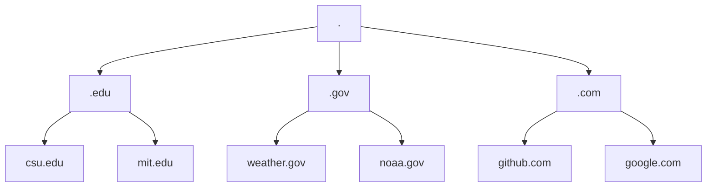

## DNS (Domain Name System) 
Provides a simple way for us to communicate with devices on the internet without remembering complex numbers.
Instead of remembering 104.26.10.229, you can remember tryhackme.com instead.

## Domain Hierarchy
| Domian | Hierarchy |
| --- | --- |
| Root Domain | . |
| Top-Level Domains | .edu |
| Second-Level Domians | csu.edu |

