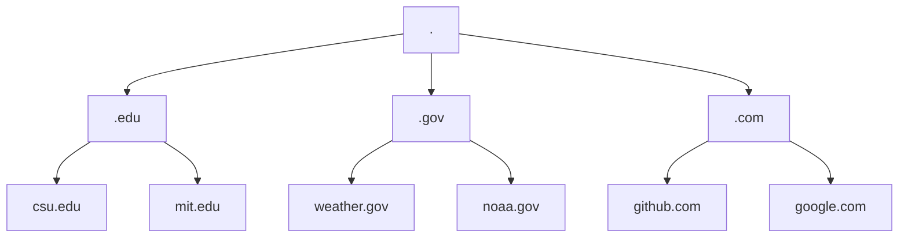

## DNS (Domain Name System) 
Provides a simple way for us to communicate with devices on the internet without remembering complex numbers.
Instead of remembering 104.26.10.229, you can remember tryhackme.com instead.

## Domain Hierarchy
| Domian | Hierarchy |
| --- | --- |
| Root Domain | . |
| Top-Level Domains | .edu |
| Second-Level Domians | csu.edu |

## Subdomains 
A subdomain sits on the left-hand side of the Second-Level Domain using a period to separate it, for example, in the name admin.tryhackme.com the admin part is the subdomain. A subdomain name has the same creation restrictions as a Second-Level Domain, being limited to 63 characters and can only use a-z 0-9 and hyphens (cannot start or end with hyphens or have consecutive hyphens). You can use multiple subdomains split with periods to create longer names, such as jupiter.servers.tryhackme.com. But the length must be kept to 253 characters or less. There is no limit to the number of subdomains you can create for your domain name.

## DNS Record Types
DNS isn't just for websites though, and multiple types of DNS record exist. Some of the most common ones are.

## A Record

These records resolve to IPv4 addresses, for example 104.26.10.229.

## AAAA Record

These records resolve to IPv6 addresses, for example 2606:4700:20::681a:be5

## CNAME Record

These records resolve to another domain name, for example, TryHackMe's online shop has the subdomain name store.tryhackme.com which returns a CNAME record shops.shopify.com. Another DNS request would then be made to shops.shopify.com to work out the IP address.

## MX Record

These records resolve to the address of the servers that handle the email for the domain you are querying, for example an MX record response for tryhackme.com would look something like alt1.aspmx.l.google.com. These records also come with a priority flag. This tells the client in which order to try the servers, this is perfect for if the main server goes down and email needs to be sent to a backup server.

## TXT Record

TXT records are free text fields where any text-based data can be stored. TXT records have multiple uses, but some common ones can be to list servers that have the authority to send an email on behalf of the domain (this can help in the battle against spam and spoofed email). They can also be used to verify ownership of the domain name when signing up for third party services.

