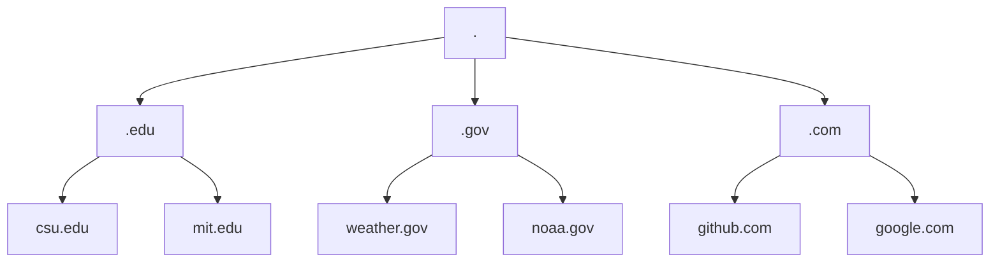

## DNS (Domain Name System) 
Provides a simple way for us to communicate with devices on the internet without remembering complex numbers.
Instead of remembering 104.26.10.229, you can remember tryhackme.com instead.

## Domain Hierarchy
| Domian | Hierarchy |
| --- | --- |
| Root Domain | . |
| Top-Level Domains | .edu |
| Second-Level Domians | csu.edu |

## Subdomains 
A subdomain sits on the left-hand side of the Second-Level Domain using a period to separate it, for example, in the name admin.tryhackme.com the admin part is the subdomain. A subdomain name has the same creation restrictions as a Second-Level Domain, being limited to 63 characters and can only use a-z 0-9 and hyphens (cannot start or end with hyphens or have consecutive hyphens). You can use multiple subdomains split with periods to create longer names, such as jupiter.servers.tryhackme.com. But the length must be kept to 253 characters or less. There is no limit to the number of subdomains you can create for your domain name.
