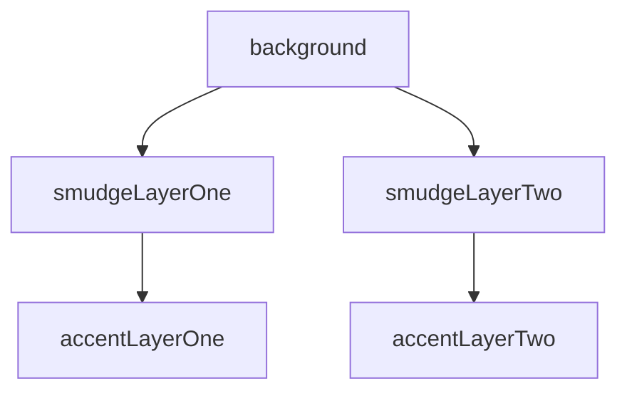
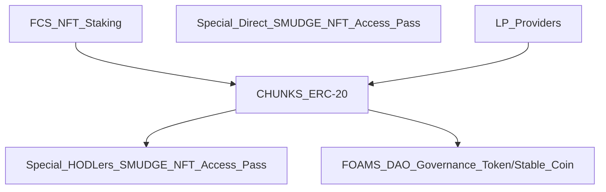

# Foam Chunk Smudge NFT: 📃 White Paper - 🚧 Work In Progress 🏗

  

- 500 Abstract Art Pieces
- Deployed to layer 2 Polygon Mainnet

The digital art program I like to use has a digital "brush" I am fond of, and I have named this project after these digital brushes.
The very large image size of 3840 x 3840 that I decided to use has created a few small issues:
- namely that the individual file size is enormous (issues with loading the large image), 
- that also limited my ability to create a token supply more than 500,
- because there was a 25GB upload limit,

but these issues with the large image size just goes to show that NFT's can have more utility and value beyond a digital art piece stored in a file.

# 💎 Rarity and Traits

- 5 seperate layers

- Background

The black background has only one instance out of 500, making that NFT the most rare.
The color of the background not only influences the composition of the art piece, it is also a factor that determines the overall rarity of the NFT.

- Smudge Layer One
- Smudge Layer Two
- Accent Layer One
- Accent Layer Two

# 🏦 FCS NFT Project Meta Economics: The Dual Purpose DAO Governance Token/Stable Coin
The primary concept driving this project economy will be the use of the Project DAO Governance Token to provide stability, serving a dual purpose and providing exceptional value while doing so.

# 🚀 FCS Project Tokenomics & Distribution
- FCS NFT Staking rewards: CHUNKS ERC-20 Utility Token
- Special Direct SMUDGE NFT Access Pass
- LP Providers rewards: CHUNKS ERC-20 Utility Token
- CHUNKS ERC-20 Utility Token burned to purchase:
  - Special HODLers SMUDGE NFT Access Pass
  - FOAMS DAO Governance Token/Stable Coin

## 🥩 Foam Chunk Smudge NFT Staking & LP Rewards
- Stake your NFT!
  - Recieve CHUNKS ERC-20 Utility Token

| Stake | Foam Chunk Smudge NFT | 
| :--: | :--: | 
| or | |
| Stake | Foam Chunk Smudge Xpanded NFT |
| or | | 
| Provide | LP | 
| Recieve | CHUNKS ERC-20 Utility Token |

## 📈 CHUNKS ERC-20 Utility Token Distribution
- CHUNKS ERC-20 Utility Token is pegged to the FOAMS DAO GT/SC via rate of inflation
  - The rate of inflation will be relative to the supply of FOAMS DAO GT/SC
  - Low supply of FOAMS DAO GT/SC will result in high inflation to encourage adoption and reward early investors
  - High supply of FOAMS DAO GT/SC will result in low inflation to encourage a stable project economy
  - The burning of tokens to purchase FOAMS DAO GT/SC will act as a deflationary event
  - The burning of tokens to purchase Special HODLers SMUDGE NFT Access Pass will act as a deflationary event
 
| Burn | CHUNKS ERC-20 Utility Token | 
| :--: | :--: | 
| Recieve | FOAMS DAO Governance Token/Stable Coin |
| or | |
| Recieve | Special HODLers SMUDGE NFT Access Pass |

| Staking Rewards & LP Providers Rewards | DAO Treasury | Project Treasury | Project Charity Fund | Founder |
| :--: | :--: | :--: | :--: | :--: |
| 80% | 10% | 5% | 2.5% | 2.5% |

## 💰 CHUNKS ERC-20 Utility Token Supply
- TODO circulating supply
- TODO total max supply
- TODO inflation rates
- TODO token burning/deflationary events

## 🗳 FOAMS DAO Governance Token/Stable Coin
- TODO 1 token = 1 vote = 1 Stable Coin
- TODO dual purpose coin
- TODO underpinning the entire ecosystem safely

## 🎟 Special ➡️ Direct SMUDGE NFT Access Pass
- Special Direct FCS NFT Access Pass
  - Gives direct access to that special event only 

| Special Direct FCS NFT Access Pass | Event |
| :--: | :--: |

## 🎟 Special 💎 HODLers SMUDGE NFT Access Pass
- Special HODLers
  - Gives acces to any designated special event

| Special HODLers FCS NFT Access Pass | Any Designated Event |
| :--: | :--: |

# 🗺 FCS RoadMap
- TODO
- TODO

# 🤝 Meet the Team!
Currently Foam Chunk Smudge NFT is a one person project.
<h1 align="center"/>Hi, 👋🏼 I'm WrappedUsername</h1> 

I am a self-taught blockchain/dapp developer, it was not easy to learn how to code from zero prior knowledge,
but I am a recovered alcoholic so I am desperately trying to rebuild my life, so I never give up and after a year of learning how 
to code I feel more confident about blockchain developement. I still have so much to learn, and a developer should always be 
learning new skills thats why I love being a developer I love exploring new ideas and learning new developer skills.

# 🥗 Project Charity Fund - Feeding America
- TODO

# 🤝 Please Join our Community!
- TODO
