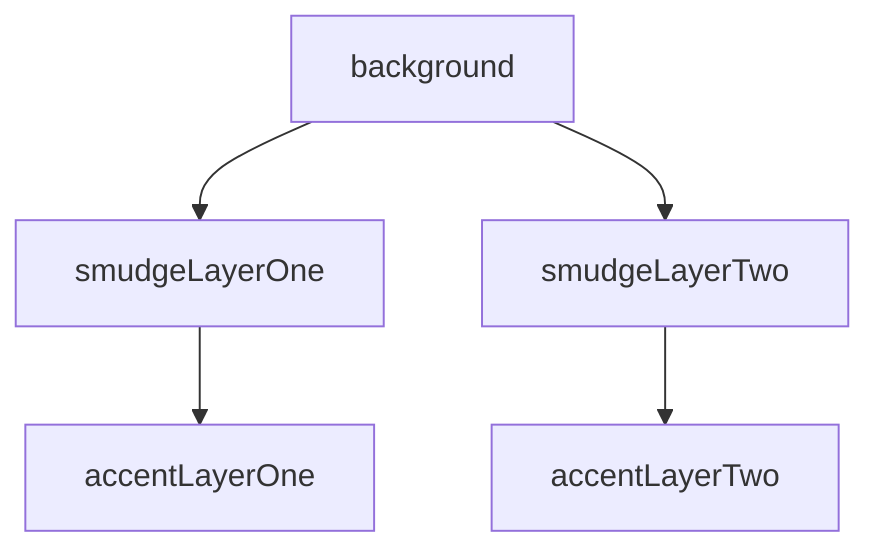
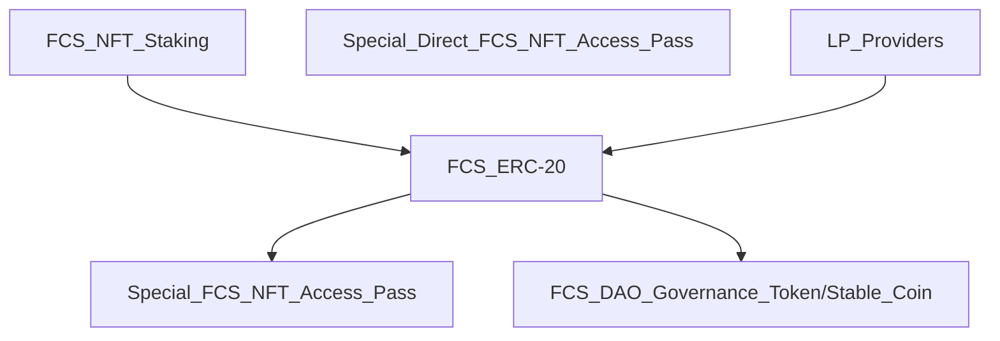

# Foam Chunk Smudge NFT: 📃 White Paper - 🚧 Work In Progress 🏗
- 500 Abstract Art Pieces
- Deployed to layer 2 Polygon Mainnet

The digital art program I like to use has a digital "brush" I am fond of, and I have named this project after these digital brushes.
The very large image size of 3840 x 3840 that I decided to use has created a few small issues:
- namely that the individual file size is enormous (issues with loading the large image), 
- that also limited my ability to create a token supply more than 500,
- because there was a 25GB upload limit,

but these issues with the large image size just goes to show that NFT's can have more utility and value beyond a digital art piece stored in a file.

# 💎 Rarity and Traits

- 5 seperate layers

- Background

The black background has only one instance out of 500, making that NFT the most rare.
The color of the background not only influences the composition of the art piece, it is also a factor that determines the overall rarity of the NFT.

- Smudge Layer One
- Smudge Layer Two
- Accent Layer One
- Accent Layer Two

# 🏦 FCS NFT Project Meta Economics: The Dual Purpose DAO Governance Token/Stable Coin
The primary concept driving this project economy will be the use of the Project DAO Governance Token to provide stability, serving a dual purpose and providing exceptional value while doing so.

- FCS NFT Staking rewards: FCS ERC-20 Utility Token
- Special Direct FCS NFT Access Pass
- LP Providers rewards: FCS-ERC20 Utility Token
- FCS ERC-20 Utility Token burned to purchase:
  - Special FCS NFT Access Pass
  - FCS DAO Governance Token/Stable Coin
  
# 🚀 FCS Project Tokenomics & Distribution
- FCS ERC-20 Staking Reward Utility Token is pegged to the FCS DAO GT/SC
  - The rate of inflation will be relative to the supply of FCS DAO GT/SC
  - The burning of tokens to purchase FCS DAO GT/SC will act as a deflationary event
  - The burning of tokens to purchase Special FCS NFT Access Pass will act as a deflationary event
  - Low supply of FCS DAO GT/SC will result in high inflation to encourage adoption and reward early investors
  - High supply of FCS DAO GT/SC will result in low inflation to encourage a stable project economy
## 🥩 & LP Rewards & FCS ERC-20 Token Distribution
| Staking Rewards & LP Providers Rewards | DAO Treasury | Project Treasury | Project Charity Fund | Founder |
| :--: | :--: | :--: | :--: | :--: |
| 80% | 10% | 5% | 2.5% | 2.5% |

- Special Direct FCS NFT Access Pass
  - Gives direct access to that special event only 

# 🗺 FCS RoadMap
- TODO
- TODO

# 🤝 Meet the Team!
- TODO

# 🥗 Project Charity Fund - Feeding America
- TODO

# 🤝 Please Join our Community!
- TODO
