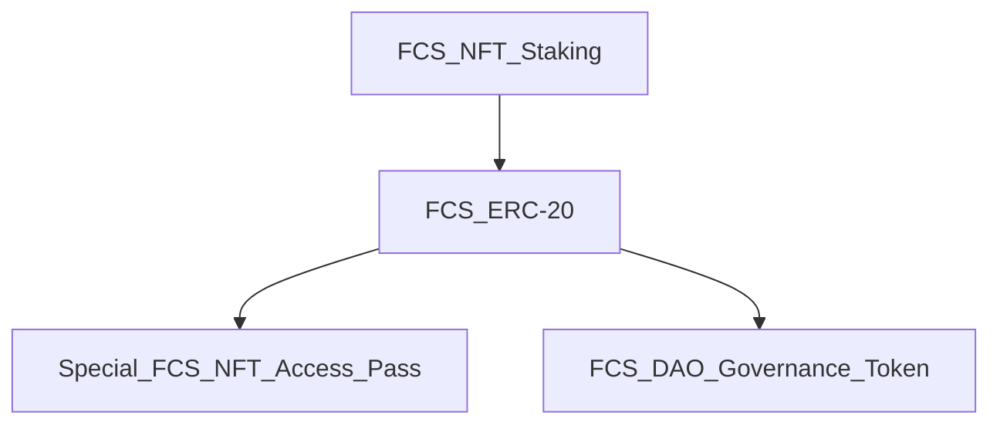

# Foam Chunk Smudge NFT: White Paper - Work In Progress
- 500 Abstract Art Pieces

The digital art program I like to use has a digital "brush" I am fond of,
and I have named this project after these digital brushes.

- 5 seperate layers

The color of the background not only influences the composition of the art piece,
it is also a factor that determines the overall rarity of the NFT.

The black background has only one instance out of 500, making that NFT the most rare.

# FCS NFT Project Economics

- FCS NFT Staking rewards: FCS ERC-20 
- FCS ERC-20 used to purchase
  - Special FCS NFT Access Pass
  - FCS DAO Governance Token
