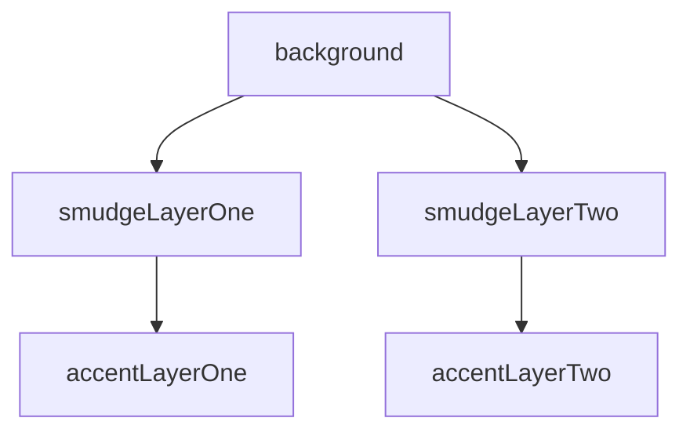
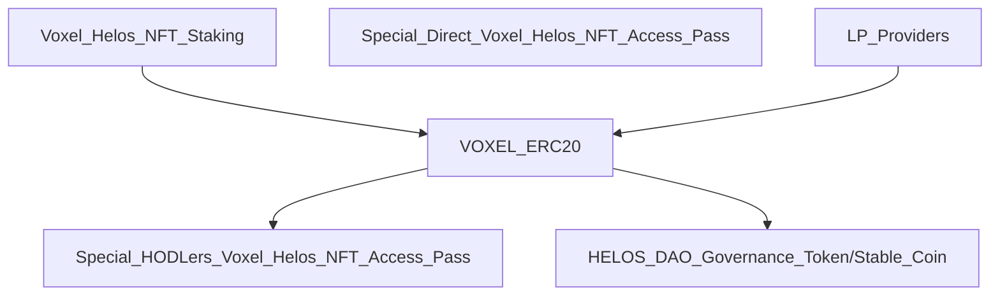

# Voxel Helos NFT: 📃 White Paper - 🚧 Work In Progress 🏗

<p align="left">  </p>

- TODO Change this when minting DApp is finished
## [Foam Chunk Smudge Minting DApp](https://foam-chunk-smudge.vercel.app/) 

```JavaScript
- 4000 Voxel SB-1 Defiant Helicopters
- Deployed to layer 2 Polygon mainnet
- Voxel OBJ files can be used in the Metaverse, or Game Worlds.
```

<p></p>

- TODO Describe Voxel art vision here

# 💎 Rarity and Traits

- TODO Change these layes when art is finished
- 5 seperate layers



- TODO Change these layes when art is finished, but keep layout.
- Background
  - The black background has only one instance out of 500, making that NFT the most rare.
  - The color of the background not only influences the composition of the art piece, it is also a factor that determines the overall rarity of the NFT.
- Smudge Layer One
  - This layer consists of smudges in grayish blues, purples, and greens
- Smudge Layer Two
  - This layer consists of smudges in grays
- Accent Layer One
  - This layer consists of accents in gold, green, and pink
- Accent Layer Two
  - This layer consists of accents in various colors

# 🏦 VH NFT Project Meta Economics: The Dual Purpose DAO Governance Token/Stable Coin©️ and NFT Staking TokenSphere©️
The primary concept driving this project economy will be the use of the Project DAO Governance Token to provide stability, serving a dual purpose and providing exceptional value while doing so.
- The Project Governance Token will double as the Stable Coin, morphing into a hybrid coin, The Dual Purpose DAO Governance Token/Stable Coin©️
- The DAO Governance Token provides outstanding stability due to the fact that 1 token = 1 vote therefore the peg will be solid
    
<h3 align="center" />🚀The Voxel Helos NFT Staking TokenSphere©️</h3>



# 🚀 Voxel Helos NFT Staking TokenSphere©️ Distribution
- Voxel Helos NFT Staking rewards = VOXEL ERC20 Utility Token
- Special Direct Voxel Helos NFT Access Pass
- LP Providers rewards = VOXEL ERC20 Utility Token
- VOXEL ERC20 Utility Token burned to purchase:
  - Special HODLers Voxel Helos NFT Access Pass
  - HELOS DAO Governance Token/Stable Coin

## 🥩 Voxel Helos NFT Staking & LP Rewards
- Stake your NFT!
  - Recieve VOXEL ERC20 Utility Token

| Stake | Voxel Helos NFT | 
| :--: | :--: | 
| or | |
| Stake | Voxel Helos Genesis NFT |
| or | | 
| Provide | LP | 
| Recieve | VOXEL ERC20 Utility Token |

## 📈 VOXEL ERC20 Utility Token Distribution
- VOXEL ERC20 Utility Token is pegged to the HELOS DAO GT/SC via rate of inflation
  - The rate of inflation will be relative to the supply of HELOS DAO GT/SC
  - Low supply of HELOS DAO GT/SC will result in high inflation to encourage adoption and reward early investors
  - High supply of HELOS DAO GT/SC will result in low inflation to encourage a stable project economy

| High Supply of | HELOS DAO GT/SC | Rate of Inflation: | Low | 25% |
| :--: | :--: | :--: | :--: | :--: |
| Low Supply of | HELOS DAO GT/SC | Rate of Inflation: | High | 100% |

    - Distribution of initial circulating supply: 125,000,000

| Staking Rewards & LP Providers Rewards | DAO Treasury | Project Treasury | Project Charity Fund | Founder |
| :--: | :--: | :--: | :--: | :--: |
| 80% | 10% | 5% | 2.5% | 2.5% |
| 100000000 | 12500000 | 6250000 | 3125000 | 3125000 |

## 💰 VOXEL ERC20 Utility Token Supply
```JavaScript
- Circulating supply: 125,000,000
- Total max supply: infinite
- Inflation rates: variable pegged to the total supply of HELOS DAO Governance Token/Stable Coin
- Token burning/deflationary events: multiple 
  - The burning of tokens to purchase HELOS DAO GT/SC will act as a deflationary event
  - The burning of tokens to purchase Special HODLers Voxel Helos NFT Access Pass will act as a deflationary event
```

| Burn | VOXEL ERC20 Utility Token | Amount | 5,000 |
| :--: | :--: | :--: | :--: |
| Recieve | HELOS DAO Governance Token/Stable Coin | 1 |
| or | | | |
| Recieve | Special HODLers Voxel Helos NFT Access Pass | 1 |

## 🚁 HELOS DAO 🗳 Governance Token/Stable Coin
```JavaScript
- The Dual Purpose Coin
- Underpinning the entire ecosystem safely
  - No algorithm to crash or manipulate the stable coin
  - Used to govern the DAO
```

| 1 Token = | 1 Vote = | 1 Stable Coin |
| :--: | :--: | :--: |

## 🎟 Special ➡️ Direct Voxel Helos NFT Access Pass
- Special Direct gets:
  - Gives direct access to that special event only 

| Special Direct Voxel Helos NFT Access Pass | Event or Item |
| :--: | :--: |

## 🎟 Special 💎 HODLers Voxel Helos NFT Access Pass
- Special HODLers get:
  - Gives acces to any designated special event

| Special HODLers Voxel Helos NFT Access Pass | Any Designated Event or Item |
| :--: | :--: |

# 🗺 Voxel Helos RoadMap

- Q2 2023
## Voxel Helos NFT & Staking TokenSphere and The Dual Purpose Governance Token/Stable Coin
    - Deployed to layer 2 Polygon mainnet

- Beyond Q2 2023
## New Collections of Foam Chunk Smudge NFT's?
    - Keep an eye on our Discord to find out if I will be dropping any more updates about the future of the project!

# 🤝 Meet the Team!
    - Currently Voxel Helos NFT is a one person project.
<h1 align="center"/>Hi, 👋🏼 I'm WrappedUsername</h1> 


<p align="center" />I am a self-taught blockchain/dapp developer, it was not easy to learn how to code from zero prior knowledge,
but I am a recovered alcoholic so I am desperately trying to rebuild my life, so I never give up and after a year of learning how 
to code I feel more confident about blockchain developement. I still have so much to learn, and a developer should always be 
learning new skills thats why I love being a developer I love exploring new ideas and learning new developer skills.</p>

# 🥗 Project Charity Fund - Feeding America
2.5% of VOXEL ERC20 Utility Token Supply will be allocated to the Project Charity Fund
- Charity Fund donations will go to local food banks across the US who are in partnership with Feeding America

# 🤝 Please Join our Community!
Hopefully you have found this white paper helpful, I put 100% effort into this project!
- If you have found this white paper helpful and would like to join our community, please 
- TODO Change this when minting DApp is finished
- Visit [Foam Chunk Smudge Minting DApp](https://foam-chunk-smudge.vercel.app/) and mint your Voxel Helos NFT today!
